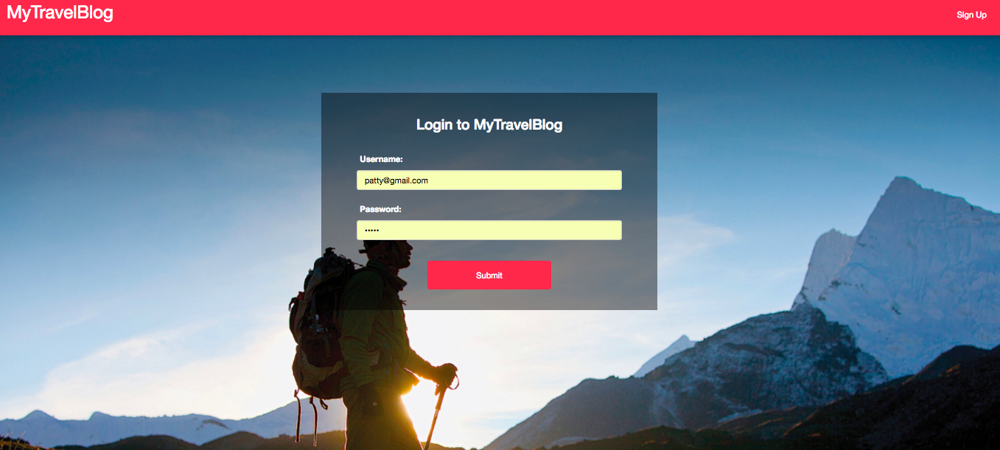
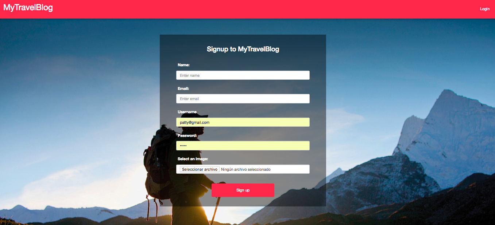
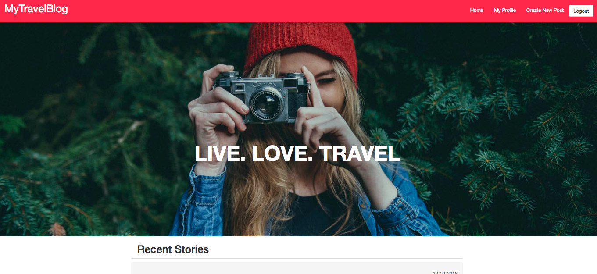
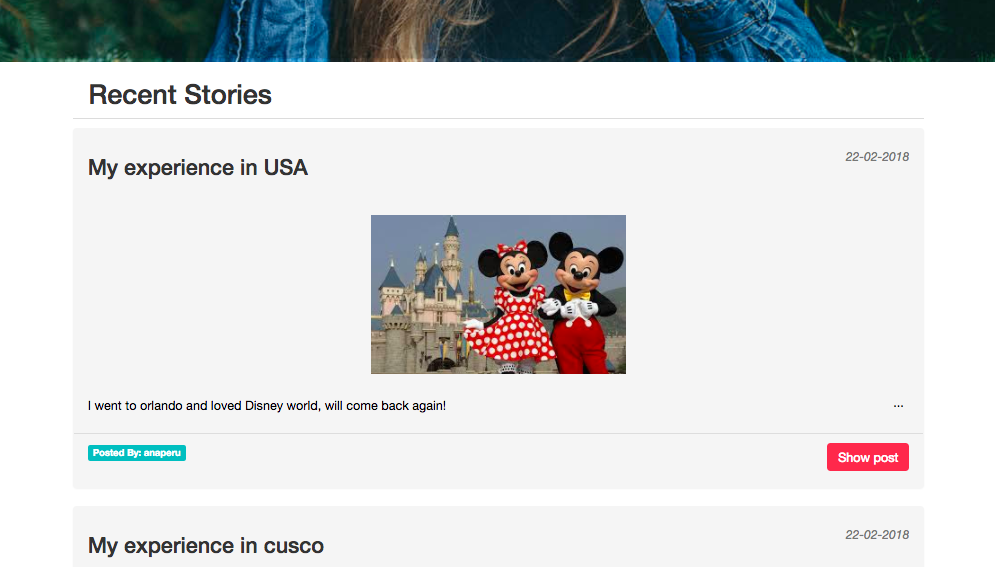
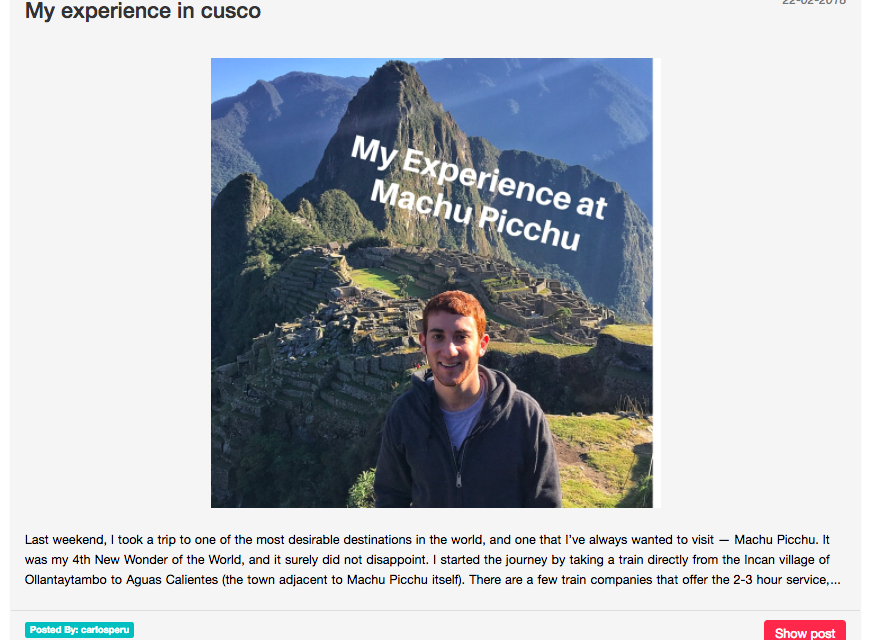
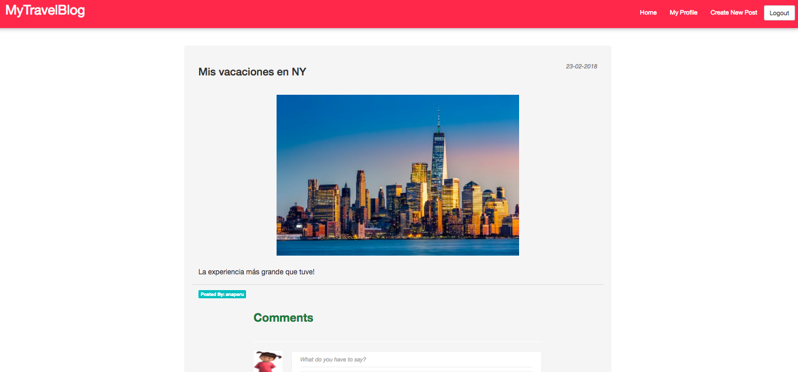
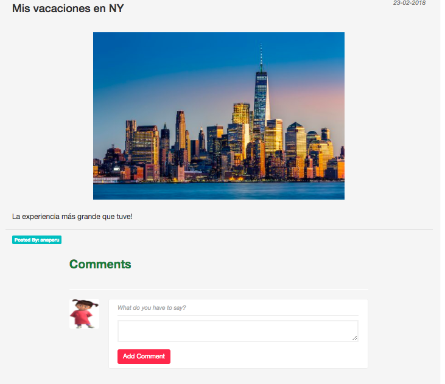
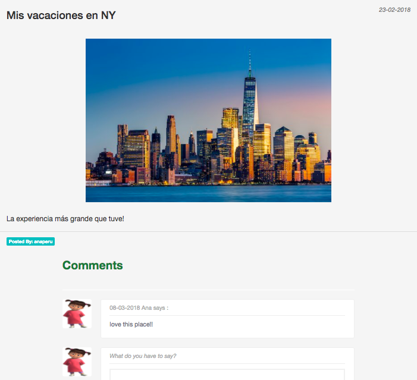
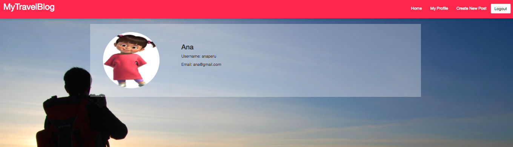
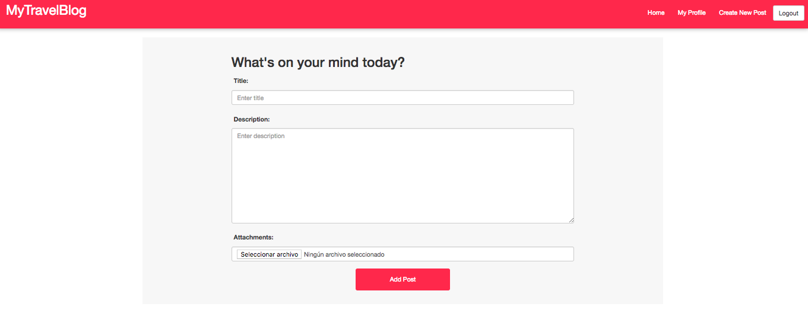

# My travelBlog Project:

This project is a single-page application blog made with React on which users can sign up, say a little about themselves, write and upload posts about their travel experiences and comments in each post.

## Features:

1. Login, registration and log out button.

2. Profile of the logged in user.

3. Upload image option in the user's profile.

4. Write and upload posts, images upload with the posts are optional.

5. Possibility to click in one post and see it completely (description and image).

5. Possibility to write comments in each post.

### Images:

